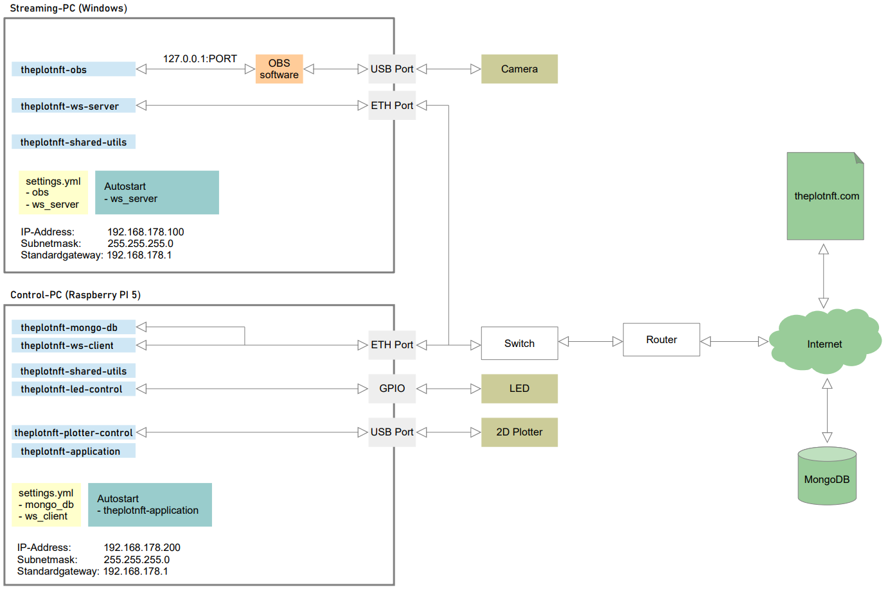
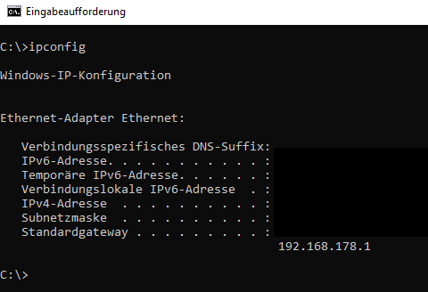
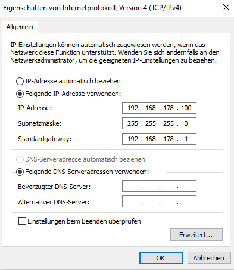

# Dokumentation-de

# Internetseite
## Webhosting
### Hetzner
### FileZilla

## Getting started
### WordPress
  WordPress Login-URL: https://theplotnft.com/wp-login.php
### PHP
### MySQL

# Beleuchtung
## LED Steuerung
Das Modul LED-Control steuert die Beleuchtung der Leinwand im Inneren von the plot nft.

Dabei kommt ein Raspberry Pi 5 zum Einsatz. An GPI015 wird ein SSR mit 3V3 geschaltet. Das Relais schließt daraufhin den 230 V Stromkreis und versorgt den LED-Treiber mit der notwendigen Betriebsspannng. Im Aus-Zustand ist somit der LED-Treiber vom Netz und es entsteht keine Verlustleistung.

Link zum GitHub Repo: [LED-Control](https://github.com/theplotnft/LED-Control/tree/main)

## Nachhaltigkeit
Um den Energieverbrauch siginfikant zu reduzieren, ist die Beleuchtung nur während des Plots eingeschaltet. Nach dem dieser beendet ist, wird ein Foto mit eingeschalter Beleuchtung erzeugt und auf der Internetseite im Bereich des live-stream dargestellt. 
Es sieht so aus, als ob ein live-stream aktiv ist. Tatzächlich ist die Kamera und die Beleuchtung inaktiv.

## LED Treiber
## LED Stripes
# 2D Stift-Plotter
## Plotter Steuerung

Link zum GitHub Repo: [Plotter-Control](https://github.com/theplotnft/Plotter-Control/tree/main)

# Gehäsue
# Leindwand
# Stift
# Blockchain
## Technologie
## Smart Contract
# NFT Marktplatz
## OpenSea
# Validator

# Hardware-Setup

## Autostart Windows 10
Nach einem Bootup des Streaming-PCs wird automatisch der Websocket Server gestartet. Der Websocket Server stellt die Verbindung zum Kontroll-PC und zu OBS her.

- WIN + R
- Eingabe `shell:startup`
    - Pfad: `C:\Users\theplotnft\AppData\Roaming\Microsoft\Windows\Start Menu\Programs\Startup`
- Datei in Ordner kopieren
    - [websocket_server.bat](files/websocket_server.bat)
- fertig

## Autostart Raspberry PI
Nach einem Bootup des Kontrol-PCs wird automatisch die Anwendung `theplotnft-application` gestartet. 

- Pfad:
- Datei:
- Command

## Standardgateway
Damit der Streaming-PC über eine interne IP-Adresse mit dem Kontroll-PC kommunizieren, und gleichzeitg eine Verbindung zum Internet herstellen kann, muss ein Gateway gesetzt werden. 
Ermittlung des Standardgateways: Verbinde den Streaming-PC und Router mit einem Netzwerkkabel.

## IP Settings Windows
Öffne Menü
- Netzwerk- und Interneteinstellungen öffnen
- Adapteroptionen ändern
- Wähle Netzwerkverbindung
- Eigenschaften
- Internetprotokoll, Version 4 (TDP/IPv4)

## IP Settings Raspberry PI
Wie gelangt man zum Menu
Screenshot

# Kamera

# Kontroll

## Kontroll-PC
Als Kontroll-PC kommt ein Raspberry Pi 5 zum Einsatz.

# Livestream
Nachdem die Eingabe validiert wurde, startet der Plottvorgang. Dieser wird Live auf [www.theplotnft.com](www.theplotnft.com) übertragen.

## Streaming-PC
Als Streaming-PC kommt ein Windows PC zum Einsatz.

### Installierte Software
Die hier aufgeführete Software ist kostenfrei.

Software                  | Quelle
------------------------- | -------------------------------------------------------------------------------------------
OBS Studio                | [Link zu externer Webseite Dritter](https://obsproject.com/de/download)
OBS Shutdown Plugin 0.1.2 | [Link zu externer Webseite Dritter](https://github.com/norihiro/obs-shutdown-plugin/releases)
VS Code                   | [Link zu externer Webseite Dritter](https://code.visualstudio.com/download)
GitHub Desktop            | [Link zu externer Webseite Dritter](https://desktop.github.com/)
Python                    | [Link zu externer Webseite Dritter](https://www.python.org/downloads/windows/)
TortoiseGit               | [Link zu externer Webseite Dritter](https://tortoisegit.org/download/)
WinSCP                    | [Link zu externer Webseite Dritter](https://winscp.net/)
Inkscape                  | [Link zu externer Webseite Dritter](https://inkscape.org/)
notepad++                 | [Link zu externer Webseite Dritter](https://notepad-plus-plus.org/downloads/)

Stand 19.03.2024

## Open Broadcaster Software - OBS Studio
- Server https://github.com/obsproject/obs-websocket
- Client https://github.com/IRLToolkit/simpleobsws

### Installation Shutdown Plugin

# Datenschutzrichtlinien
